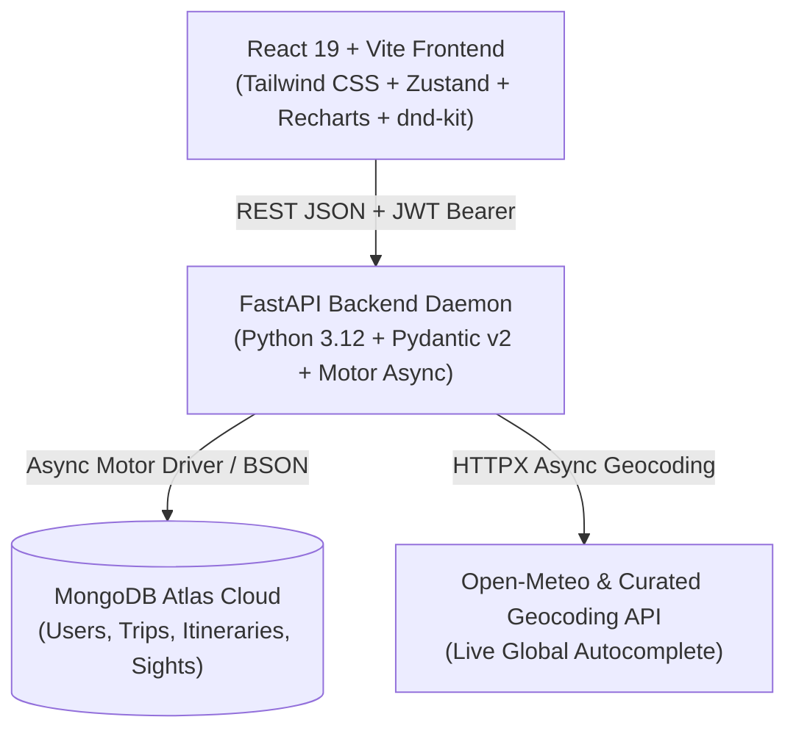

# 🌍 GlobeTrotter — Empowering Personalized Travel Planning

[](https://fastapi.tiangolo.com)
[](https://reactjs.org/)
[](https://vitejs.dev/)
[](https://tailwindcss.com/)
[](https://www.mongodb.com/atlas)
[](LICENSE)

> **GlobeTrotter** is a personalized, intelligent, and collaborative travel planning platform that transforms how travelers design, budget, and experience multi-city journeys. Built with an end-to-end relational document architecture, real-time Google-like search autocomplete, authentic attraction discovery, interactive circular financial analytics in ₹ (INR), drag-and-drop itinerary builders, and comprehensive admin controls.

---

## 📸 Overview & Key Highlights

- **✨ Unified Stop Data Architecture:** Flights, hotels, activities, expenses, and dates for each destination stop are persisted inside a unified, flexible document schema in MongoDB Atlas.
- **🔍 Google-Style Live Autocomplete Search:** Instant geocoding & landmark suggestions layered above all UI viewports with keyboard navigation and country-aware prioritization.
- **🏛️ Authentic Attraction Discovery:** Curated must-visit sights with genuine high-resolution imagery, estimated durations, and direct **`+ Day 1` / `+ Day 2` / `+ Day 3`** dynamic assignment buttons.
- **💰 No-Assumption Budgeting & Circular Financial Graphs:** Explicit budget configuration in **₹ (INR)** with interactive Recharts donut/pie breakdowns dividing expenses across transit, lodging, activities, and dining.
- **📅 Full Calendar Synchronization:** Multi-view itinerary calendar (Month, Week, Day, Agenda) color-coding flights (Blue), hotels (Purple), sights (Green), and destinations (Amber).
- **👥 Community Itinerary Sharing & 1-Click Cloning:** Public travel discovery feed with social sharing (WhatsApp, Twitter/X, Facebook) and full itinerary cloning.
- **🛡️ Admin Analytics & User Trips Inspector:** Executive control panel featuring platform adoption charts, popular cities/activities metrics, user role toggles, and an interactive drawer to inspect any user's created trips.
- **🎨 Warm Sunset & Amber Design System:** Carefully crafted palette with Sunset Coral (`#F43F5E`), Amber Gold (`#D97706`), and Warm Sand accents.

---

## 📋 Comprehensive Feature Matrix (13 Problem Statement Screens)

| # | Screen / Module | Key Functionality & Highlights |
|---|---|---|
| **1** | **Login Screen** (`/login`) | JWT Token authentication, session persistence, input validation, and interactive **Forgot Password modal**. |
| **2** | **Registration Screen** (`/register`) | Multi-field user signup with First/Last Name, Email, Phone, City, Country, Password, and automatic session clearing. |
| **3** | **Dashboard / Landing** (`/dashboard`) | Personalized welcome greeting, hero CTA, recent itineraries carousel, and **Top Regional Recommendations** (Ahmedabad, Mumbai, Jaipur, Goa). |
| **4** | **Create Trip Screen** (`/trips/create`) | Autocomplete place search, explicit **Total Budget in ₹ (Rupees)** input, date pickers, notes textarea, and authentic cover photo presets. |
| **5** | **Itinerary Builder** (`/trips/:id/builder`) | Unified stop cards, **`dnd-kit` drag-and-drop reordering**, flights & hotel toggles, custom activity tagger, **Must-Visit Sights shelf with `+ Day 1/2/3` buttons**, and **Circular Budget Pie Chart**. |
| **6** | **My Trips (List View)** (`/trips`) | Categorized tabs for **Ongoing**, **Upcoming**, and **Past Memories**, with explicit **View**, **Edit in Builder**, and **Delete Trip** actions. |
| **7** | **User Profile / Settings** (`/profile`) | Avatar identity, editable bio, **Language Preference Selector** (English, Spanish, French, German, Japanese), **Saved Destinations Wishlist**, and **Permanent Account Deletion** (`DELETE /users/me`). |
| **8** | **City Search Catalog** (`/explore`) | Global city search with country metadata, cost index (`$ / $$ / $$$`), popularity score, region filters, and instant `+ Add to Trip` button. |
| **9** | **Activity & Sights Search** (`/explore`) | Filterable category pills (*Culture, History, Adventure, Nature, Wellness*), duration tags, cost breakdowns, and direct trip planner integration. |
| **10** | **Itinerary View with Budget** (`/trips/:id`) | Day-by-day structured timeline, transit cards, hotel vouchers, **Interactive Budget Breakdown Pie Chart**, **Average Cost / Day metric**, and **Overbudget Alert Banner**. |
| **11** | **Trip Calendar** (`/calendar`) | **React Big Calendar** with Month, Week, Day, and Agenda views, trip switcher dropdown, and category color pins. |
| **12** | **Shared Community View** (`/community`) | Public travel feed, search filter, active **`❤️ Like` counter**, **`Copy Trip` / Clone Itinerary button**, and social media sharing. |
| **13** | **Admin Analytics Dashboard** (`/admin`) | 4-tab control center (*Manage Users, Popular Cities, Popular Activities, User Trends*), user role switcher, spend distribution pie chart, and **User Trips Inspector Modal**. |

---

## 🛠️ Technology Stack & Architecture



### Frontend
- **Framework:** React 19 + Vite
- **Styling:** Tailwind CSS (Custom Warm Sunset & Amber Design System)
- **State Management:** Zustand with local session storage persistence
- **Drag and Drop:** `@dnd-kit/core` & `@dnd-kit/sortable`
- **Charts & Data Visualization:** Recharts (Responsive Pie, Bar, and Line charts)
- **Icons:** Lucide React Icons
- **Calendar:** React Big Calendar + date-fns

### Backend
- **Framework:** FastAPI (Python 3.12)
- **Database Driver:** Motor (Async PyMongo) with Certifi SSL encryption
- **Data Validation:** Pydantic v2 Models & ISO-8601 JSON serialization
- **Security:** OAuth2 Password Bearer with JWT access tokens and Passlib Bcrypt hashing
- **Geocoding & Autocomplete:** HTTPX asynchronous geocoding proxy

---

## 🚀 Getting Started & Local Setup

### 1. Prerequisites
- **Node.js:** v18.0 or higher
- **Python:** 3.10, 3.11, or 3.12
- **MongoDB:** Active MongoDB Atlas connection URI or local MongoDB daemon

---

### 2. Clone the Repository
```bash
git clone https://github.com/Yashshah343/odoo-hackathon-vr.git
cd odoo-hackathon-vr
```

---

### 3. Backend Setup
```bash
cd backend
python -m venv venv

# On Windows (PowerShell):
.\venv\Scripts\Activate.ps1
# On Linux / macOS:
source venv/bin/activate

pip install -r requirements.txt
```

Create a `.env` file in `backend/`:
```env
MONGODB_URL=mongodb+srv://<username>:<password>@cluster0.sszl7mu.mongodb.net/?appName=Cluster0
DATABASE_NAME=globetrotter
SECRET_KEY=your_super_secret_jwt_key_here
ACCESS_TOKEN_EXPIRE_MINUTES=1440
```

Start the backend server:
```bash
uvicorn app.main:app --host 127.0.0.1 --port 8000 --reload
```

---

### 4. Frontend Setup
In a separate terminal:
```bash
cd frontend
npm install
npm run dev
```

The frontend will run at: **[http://localhost:5173](http://localhost:5173)**  
The backend API documentation & Swagger UI is live at: **[http://127.0.0.1:8000/docs](http://127.0.0.1:8000/docs)**

---

### ⚡ Single-Command Startup (Unified Runner)
You can launch both the backend and frontend simultaneously with a single command from the project root:
```bash
python run.py
```

---

## 📡 API Endpoint Overview

| Method | Endpoint | Description |
|---|---|---|
| `POST` | `/api/v1/auth/register` | Register a new user account |
| `POST` | `/api/v1/auth/login` | Authenticate user & issue JWT token |
| `GET` | `/api/v1/users/me` | Fetch authenticated user profile |
| `PUT` | `/api/v1/users/me` | Update profile, bio, and language preferences |
| `DELETE` | `/api/v1/users/me` | Permanently delete user account and itineraries |
| `GET` | `/api/v1/trips` | List all trips for current user (filtered by status) |
| `POST` | `/api/v1/trips` | Create a new trip with dates and description |
| `GET` | `/api/v1/trips/{id}` | Retrieve single trip with all itinerary sections |
| `PUT` | `/api/v1/trips/{id}` | Update stops, flights, hotels, activities & budget |
| `DELETE` | `/api/v1/trips/{id}` | Delete an existing trip |
| `POST` | `/api/v1/trips/{id}/clone` | Clone/copy a public community itinerary |
| `POST` | `/api/v1/trips/{id}/like` | Like or unlike a public itinerary |
| `GET` | `/api/v1/places/search` | Live place & landmark autocomplete search |
| `GET` | `/api/v1/places/attractions` | Retrieve authentic must-visit attractions for any city |
| `GET` | `/api/v1/admin/analytics` | Admin platform stats, charts, and user list |
| `GET` | `/api/v1/admin/users/{id}/trips` | Inspect all trips created by a specific user |
| `PUT` | `/api/v1/admin/users/{id}/role` | Toggle user role between `user` and `admin` |

---

## 🎨 Design System

| Token | Value | Description |
|---|---|---|
| **Primary Amber** | `#D97706` / `#F59E0B` | Core action buttons, highlights, and active states |
| **Sunset Coral** | `#F43F5E` / `#FB7185` | Secondary gradients, alerts, and badges |
| **Warm Sand** | `#FFFBEB` | Card backgrounds, search panels, and soft containers |
| **Emerald Accent** | `#10B981` | Success states, confirmed flights, and remaining balance |
| **Indigo / Purple** | `#6366F1` / `#8B5CF6` | Accommodations, hotels, and admin analytics |
| **Currency** | `₹` (INR) | Standard monetary unit with thousand separators |

---

## 👥 Authors & Hackathon Team

- **Dhruv Patel** ([@Dhruv-patel-17](https://github.com/Dhruv-patel-17))
- **Yash Shah** ([@Yashshah343](https://github.com/Yashshah343))
- **Pranay Jadav** ([@Pranayy-Jadavv](https://github.com/Pranayy-Jadavv))

---

## 📄 License
This project is open source and available under the [MIT License](LICENSE).
